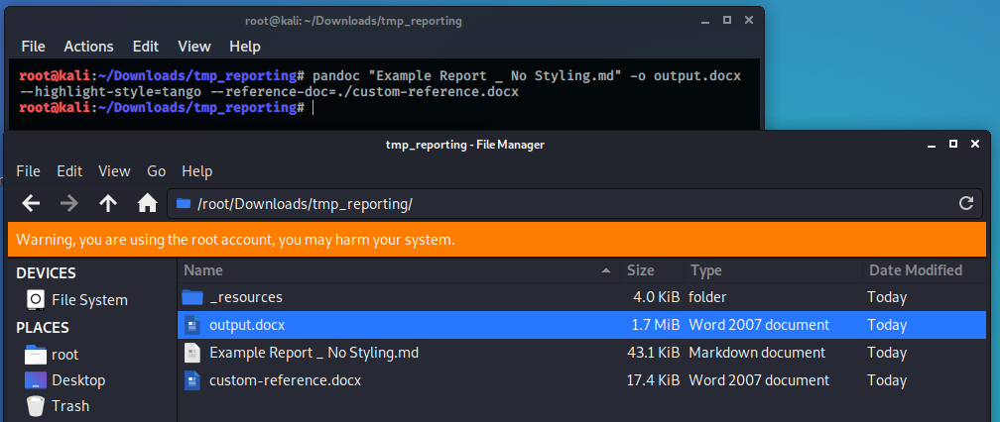

# OSCP / PWK Markdown Reporting Templates and Pandoc Reference Style

This repo contains the templates I used for OSCP / PWK lab and exam reporting, as well as the basic styles I used to convert the markdown report to a (relatively) slick-looking and organized report, while preserving code formatting and syntax highlighting. To achieve this I generate the PDF based on an intermediary Word file generated through Pandoc.

The repo also contains some [examples](https://github.com/chvancooten/OSCP-MarkdownReportingTemplates/tree/master/Examples) to show what a report may come to look like. Note that the final conversion to Word from PDF does require some manual styling work (which is actually what I personally preferred). Since I obviously cannot disclose any PWK lab or exam writeups, I've used some VulnHub writeups as filler instead. Don't open the example report if you don't want spoilers for `Brainpan`, `Kioptrix2014`, `Zico`, or `LazyAdmin`. 🙃

## Requirements

- A Markdown editor of your choosing
- [Pandoc](https://pandoc.org/)
- `1337 hacking skillz`

## How to use

### Preparing markdown report

The markdown templates are fairly straightforward. I strongly recommend using a Markdown editor that has decent backup / synchronization features as well as a feature to copy and paste screenshots (must-have IMO). I used [Joplin](https://joplinapp.org/) as a daily editor, and [VS Code](https://code.visualstudio.com/docs/languages/markdown) to compile and streamline the final report.

While doing the labs or exam, I would recommend keeping separate write-ups per machine, based on the template you aim to use for reporting. Once you are happy with your separate machine write-ups and ready to compile them into a report, export your markdown files (if needed) and ensure that all the images are intact. Then, compile a master document with an appropriate introduction to, and summary of, your work. For this I have included the Lab and Exam Report templates, which are based on OffSec's own reporting templates.

### Preparing `reference.docx` for custom styling (optional)

The `reference.docx` file determines the basic styling of your intermediate Word document. I have included an example file which covers all the styles, but you can generate and adapt your own if you want.

You can export a reference file as follows:

```
pandoc --print-default-data-file reference.docx > custom-reference.docx
```

Edit the styles embedded in the document as desired to determine how Pandoc will generate your report. 

> Don't overlook the many important styles styles (such as "source code") that are hidden, you can see the full overview by clicking the "box-with-arrow" on the bottom right of the styling section in Word, and edit the styles from there.

### Generating intermediate .docx report

To maintain full control of the output report, I worked with an intermediate report in Word format. You can generate this report as follows. [This article](https://www.garrickadenbuie.com/blog/pandoc-syntax-highlighting-examples/) has a nice and visual representation of the different syntax highlighting styles that Pandoc offer by default.

```
pandoc "Example Report _ No Styling.md" -o output.docx --highlight-style=tango --reference-doc=./custom-reference.docx
```



### Finalizing the report 

The pandoc reference document covers a lot of the styling, but not everything that I wanted to. As such, I adapted the following manually to ensure that the output document is nice and sleek:

- Title page formatting
- Table of contents
- Page numbering
- Image Sizes
  - Some images come out really big, depending on the aspect ratio of the original image. This could be solved by using something like `{ width=250px }` in your original MarkDown file, but I just went through to manually resize images to the right size.

### Exporting PDF

OffSec expects your report in PDF format. This shouldn't be much of a hurdle though.
